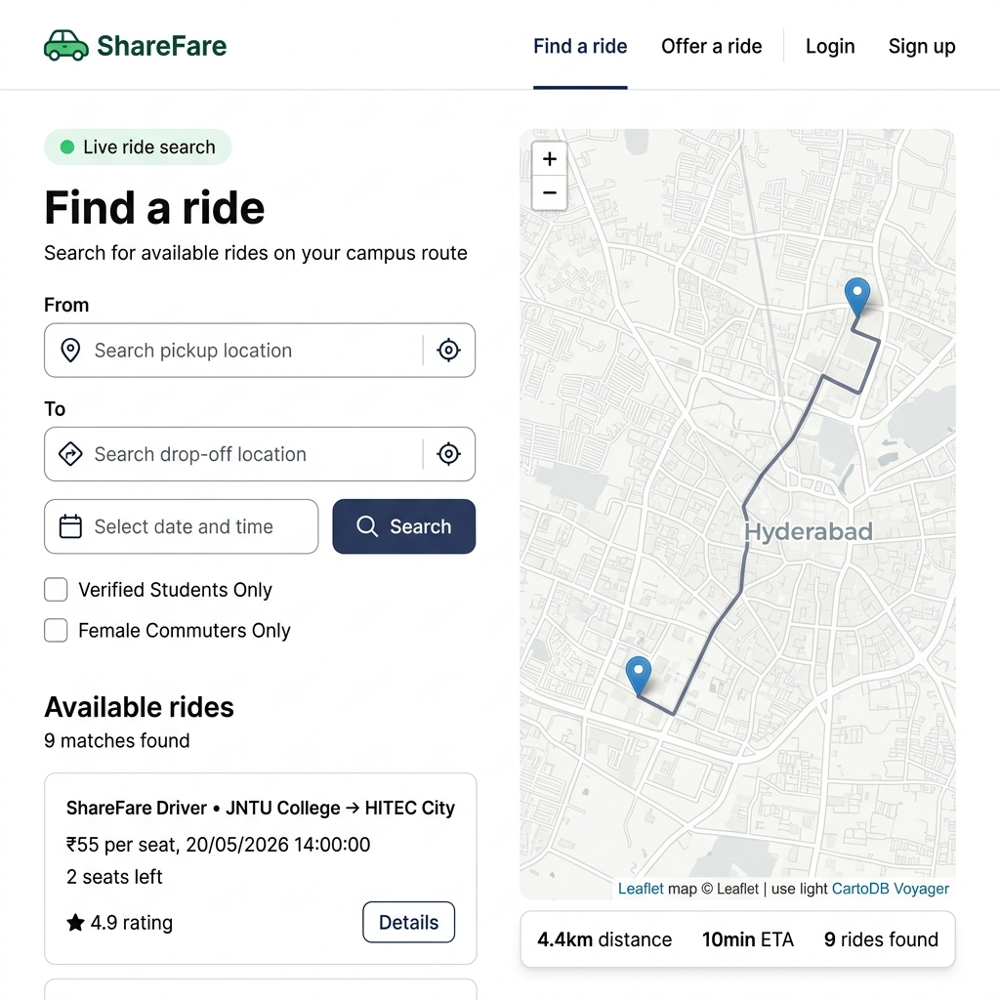
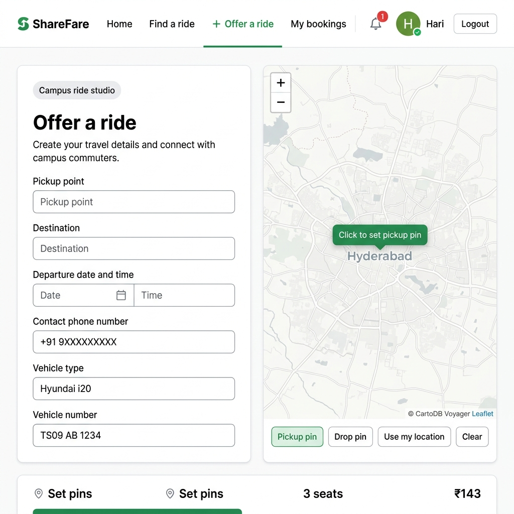
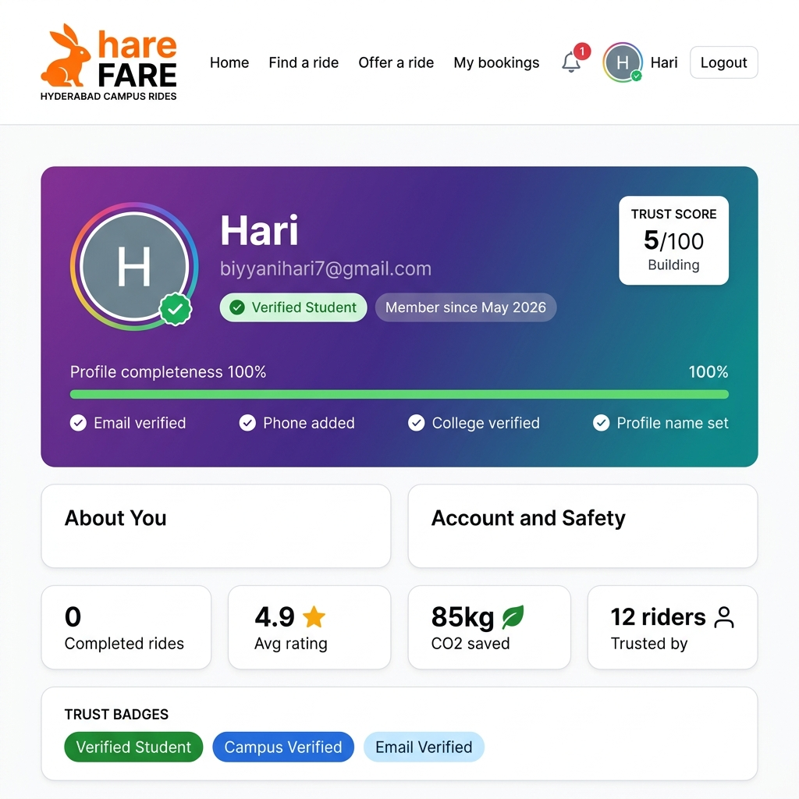
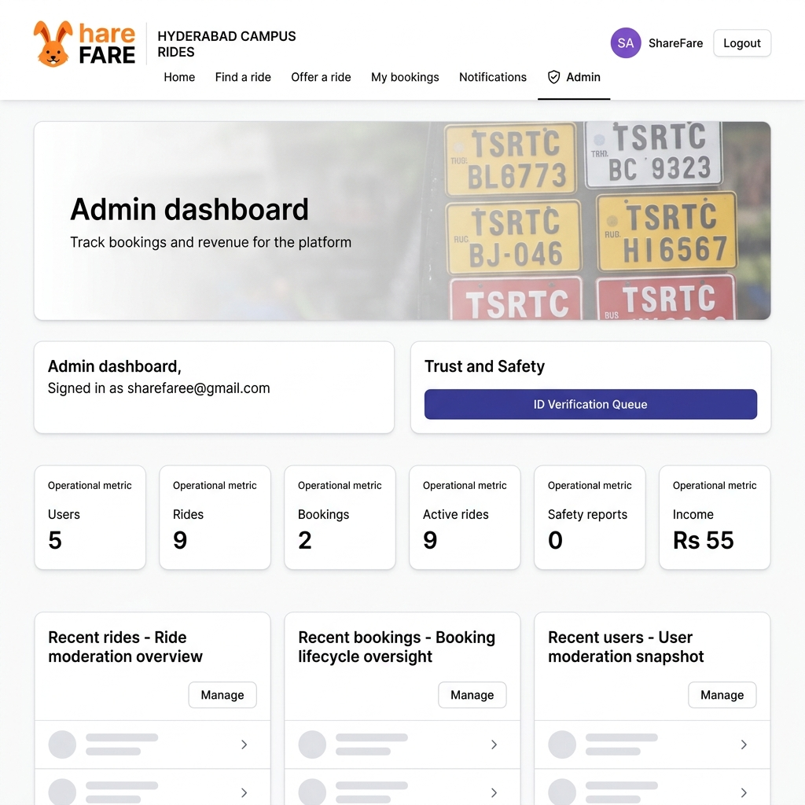

<div align="center">


# ShareFare

### Verified Campus Mobility Platform for Hyderabad Students

**Offer and book rides with verified college peers. Split costs, travel safely, build trust.**

---

[](https://openjdk.org/projects/jdk/21/)
[](https://spring.io/projects/spring-boot)
[](https://react.dev)
[](https://www.typescriptlang.org)
[](https://tailwindcss.com)
[](https://www.postgresql.org)

[](LICENSE)
[](CONTRIBUTING.md)

</div>

---

## 📖 Overview

**ShareFare** is a production-grade, full-stack campus mobility platform built for Hyderabad college students. It lets any **verified student** offer or book rides — eliminating the need for a separate "driver" account. The platform emphasises **identity trust**, **safety preferences**, and a **premium UX** inspired by BlaBlaCar, Uber, and modern fintech apps.

> Built as a real engineering project demonstrating full-stack architecture, JWT security, interactive maps, admin workflows, and scalable Spring Boot APIs.

---

## ✨ Features

| Feature | Description |
|---|---|
| 🎓 **Verified Campus Network** | Only students with verified campus IDs can publish or book rides |
| 🔐 **JWT Authentication** | Secure sign-up, login, and session management with role-based access |
| 🗺️ **Interactive Live Maps** | Leaflet.js maps with real road routing via OSRM, pickup/drop pin placement |
| 🚗 **Offer & Book Rides** | Complete ride lifecycle — publish, search, request, approve, confirm, complete |
| 👩‍💼 **Admin Dashboard** | Verify student IDs, moderate content, manage users and ride data |
| 📋 **Booking Lifecycle** | REQUESTED → DRIVER_APPROVED → CONFIRMED → ONGOING → COMPLETED |
| 🔔 **In-App Notifications** | Ride updates, booking approvals, verification status changes |
| 📧 **Transactional Email** | Gmail SMTP-powered emails for ride reminders and verification updates |
| 🚺 **Gender Safety Preferences** | Female-commuter-only filter for safer travel options |
| 🛡️ **Trust Score System** | Dynamic trust badges and scores based on ride history and verification |
| 📊 **Profile Ecosystem** | Profile completeness, trust rings, CO₂ saved tracker, reliability score |
| 📱 **Responsive Premium UI** | Glassmorphism, dark mode hero sections, Framer Motion micro-animations |

---

## 🖥️ Screenshots

> _Add screenshots to the `docs/screenshots/` folder and reference them below._

| Landing Page | Find a Ride | Offer a Ride |
|---|---|---|
|  |  |  |

| Profile Dashboard | Admin Panel | Ride Details |
|---|---|---|
|  |  |  |

---

## 🏗️ Architecture

```
sharefare/
├── sharefare-frontend/          # React + TypeScript + Vite SPA
│   ├── src/
│   │   ├── components/          # Reusable UI components + design system
│   │   ├── pages/               # Route-level page components
│   │   ├── state/               # Auth context and global state
│   │   ├── lib/                 # API client, geocoding, routing utils
│   │   └── index.css            # Global styles + Tailwind directives
│   └── public/
│       └── images/              # Hero images and assets
│
├── sharefare-backend/           # Spring Boot REST API
│   └── src/main/java/com/sharefare/
│       ├── controller/          # REST endpoints
│       ├── service/             # Business logic
│       ├── model/               # JPA entities
│       ├── dto/                 # Request/Response DTOs
│       ├── repo/                # Spring Data JPA repositories
│       ├── security/            # JWT filter, UserDetailsService
│       ├── config/              # CORS, Security, JPA config
│       ├── exception/           # Global exception handler
│       └── startup/             # Seed data + migration runners
│
└── docs/                        # Architecture docs and screenshots
```

**Request flow:**
```
Browser → React SPA → Axios (JWT header) → Spring Boot REST API
                                          → JPA / Hibernate
                                          → H2 (dev) / PostgreSQL (prod)
```

---

## 🛠️ Tech Stack

### Frontend
| Technology | Version | Purpose |
|---|---|---|
| React | 18 | Component-based UI framework |
| TypeScript | 5 | Type-safe JavaScript |
| Vite | 5 | Build tool and dev server |
| Tailwind CSS | 3 | Utility-first CSS |
| Framer Motion | 11 | Animations and micro-interactions |
| Leaflet.js | 1.9 | Interactive maps |
| React Router | 6 | Client-side routing |
| Axios | 1.7 | HTTP client with interceptors |

### Backend
| Technology | Version | Purpose |
|---|---|---|
| Java | 21 | Core language (LTS) |
| Spring Boot | 3.4 | REST API framework |
| Spring Security | 6 | Authentication and authorization |
| Spring Data JPA | 3.4 | ORM and repositories |
| JJWT | 0.12 | JWT token generation and validation |
| H2 Database | 2 | Local development DB |
| PostgreSQL | 16 | Production database |
| Maven | 3.9 | Build and dependency management |
| SpringDoc OpenAPI | 2.8 | Auto-generated API docs (Swagger UI) |

---

## 🚀 Getting Started

### Prerequisites

- **Node.js** 20+ and npm
- **Java** 21+
- **Maven** 3.9+
- (Optional) **Docker** for PostgreSQL

### 1. Clone the repository

```bash
git clone https://github.com/hari07-git/sharefare.git
cd sharefare
```

### 2. Configure environment variables

```bash
# Copy the example file and fill in your values
cp .env.example .env
```

Open `.env` and replace placeholders with real values. See [Environment Variables](#-environment-variables) section.

---

### 3. Start the Backend

```bash
cd sharefare-backend

# Run with local H2 database (no setup needed)
mvn spring-boot:run

# API will be available at: http://localhost:8080
# Swagger UI: http://localhost:8080/swagger-ui/index.html
# H2 Console: http://localhost:8080/h2-console
```

### 4. Start the Frontend

```bash
cd sharefare-frontend

# Install dependencies
npm install

# Start dev server
npm run dev

# App will be available at: http://localhost:5173
```

---

## 🔧 Environment Variables

Create a `.env` file in the project root by copying `.env.example`:

| Variable | Description | Example |
|---|---|---|
| `PORT` | Backend server port | `8080` |
| `DB_URL` | JDBC database URL | `jdbc:h2:file:./data/sharefare-local` |
| `DB_USER` | Database username | `sa` |
| `DB_PASSWORD` | Database password | *(empty for H2)* |
| `JWT_SECRET` | JWT signing secret (min 32 chars) | `your-random-secret-here` |
| `JWT_TTL_SECONDS` | Token expiry in seconds | `86400` |
| `ADMIN_EMAIL` | Initial admin account email | `admin@yourdomain.com` |
| `ADMIN_PASSWORD` | Initial admin account password | `StrongPassword@123` |
| `SPRING_MAIL_USERNAME` | Gmail address for sending emails | `your@gmail.com` |
| `SPRING_MAIL_PASSWORD` | Gmail App Password (not your login password) | `xxxx xxxx xxxx xxxx` |
| `VITE_API_BASE_URL` | Backend URL for the frontend | `http://localhost:8080` |
| `FRONTEND_BASE_URL` | Frontend URL for email links | `http://localhost:5173` |

> **Gmail App Password:** Enable 2FA on your Google account → Google Account → Security → App Passwords → Generate one for "Mail".

---

## 📡 API Overview

The backend exposes a full REST API documented via **Swagger UI** at `/swagger-ui/index.html`.

| Module | Endpoint Prefix | Description |
|---|---|---|
| Auth | `POST /api/auth/register` | Register a new student account |
| Auth | `POST /api/auth/login` | Login and receive JWT |
| Profile | `GET /api/me` | Get current user profile |
| Rides | `POST /api/rides` | Publish a new ride |
| Rides | `GET /api/rides/search` | Search available rides |
| Bookings | `POST /api/bookings` | Book a ride |
| Bookings | `PATCH /api/bookings/{id}/confirm` | Confirm a booking |
| Admin | `GET /api/admin/verifications` | View pending verifications |
| Admin | `POST /api/admin/verify/{userId}` | Approve student verification |
| Notifications | `GET /api/me/notifications` | Get user notifications |

Full interactive docs: `http://localhost:8080/swagger-ui/index.html`

---

## 🌐 Deployment

### Frontend → Vercel / Netlify

```bash
cd sharefare-frontend
npm run build          # Builds to dist/
```

**Vercel deployment:**
1. Connect your GitHub repo to [vercel.com](https://vercel.com)
2. Set root directory to `sharefare-frontend`
3. Add environment variable: `VITE_API_BASE_URL=https://your-api.onrender.com`
4. Deploy

**Netlify deployment:**
1. Build command: `npm run build`
2. Publish directory: `sharefare-frontend/dist`

---

### Backend → Render / Railway

**Render:**
1. Create a new **Web Service** on [render.com](https://render.com)
2. Connect GitHub repo, set root directory to `sharefare-backend`
3. Build command: `mvn package -DskipTests`
4. Start command: `java -jar target/sharefare-backend-*.jar`
5. Add all environment variables from `.env.example`
6. Add a **PostgreSQL** database service and set `DB_URL`

**Railway:**
1. Create project, connect repo
2. Add PostgreSQL plugin
3. Set `DB_URL` from Railway's PostgreSQL connection string

**Required production environment variables:**
```
DB_URL=jdbc:postgresql://...
DB_USER=...
DB_PASSWORD=...
JWT_SECRET=<strong-random-secret-minimum-64-chars>
ADMIN_EMAIL=admin@yourdomain.com
ADMIN_PASSWORD=<strong-password>
SPRING_MAIL_USERNAME=...
SPRING_MAIL_PASSWORD=...
FRONTEND_BASE_URL=https://your-app.vercel.app
SAMPLE_DATA_ENABLED=false
```

---

## 📁 Project Structure

```
sharefare/
├── .env.example                        # Environment variables template
├── .gitignore                          # Security-focused gitignore
├── README.md                           # This file
│
├── sharefare-frontend/                 # React SPA
│   ├── public/
│   │   └── images/                    # Hero images and brand assets
│   ├── src/
│   │   ├── components/                # UI components
│   │   │   ├── AuthShell.tsx          # Auth page layout
│   │   │   ├── DarkMap.tsx            # Interactive Leaflet map
│   │   │   ├── LiveRideTracker.tsx    # Real-time route simulation
│   │   │   ├── Navbar.tsx             # Top navigation
│   │   │   └── design-system.tsx      # Design tokens & layout
│   │   ├── pages/
│   │   │   ├── LandingPage.tsx        # Public hero page
│   │   │   ├── HomePage.tsx           # Authenticated dashboard
│   │   │   ├── FindRidePage.tsx       # Search + map view
│   │   │   ├── OfferRidePage.tsx      # Publish a ride
│   │   │   ├── RideDetailsPage.tsx    # Ride detail + booking
│   │   │   ├── ProfilePage.tsx        # User profile dashboard
│   │   │   ├── NotificationsPage.tsx  # Notifications inbox
│   │   │   └── AdminPage.tsx          # Admin moderation panel
│   │   ├── state/
│   │   │   └── auth.tsx               # Auth context (JWT, user state)
│   │   └── lib/
│   │       ├── api.ts                 # Axios client with JWT interceptor
│   │       ├── geocode.ts             # Nominatim place search
│   │       └── route.ts               # Distance and fare estimation
│   └── package.json
│
├── sharefare-backend/                  # Spring Boot API
│   ├── src/main/java/com/sharefare/
│   │   ├── controller/                # REST controllers
│   │   ├── service/                   # Business logic
│   │   ├── model/                     # JPA entities
│   │   ├── dto/                       # Request/Response objects
│   │   ├── repo/                      # JPA repositories
│   │   ├── security/                  # JWT + Spring Security
│   │   ├── config/                    # App configuration
│   │   ├── exception/                 # Error handling
│   │   └── startup/                   # Data seeding + migration
│   ├── src/main/resources/
│   │   └── application.yml            # App config (uses env vars)
│   ├── docker-compose.yml             # PostgreSQL for local dev
│   └── pom.xml
│
└── docs/
    └── screenshots/                   # App screenshots
```

---

## 🗺️ Roadmap

- [x] JWT authentication with role-based access
- [x] Student verification workflow (admin approval)
- [x] Offer and book rides with map-first UI
- [x] Complete booking lifecycle management
- [x] In-app notifications + email reminders
- [x] Trust score and profile ecosystem
- [x] Gender safety preferences
- [x] Admin moderation dashboard
- [ ] Real-time WebSocket ride tracking
- [ ] Rating and review system post-ride
- [ ] Push notifications (Firebase)
- [ ] React Native mobile app
- [ ] Recurring route / commute subscriptions
- [ ] Payment integration (UPI via Razorpay)
- [ ] College-level leaderboards and rewards

---

## 🤝 Contributing

Contributions are welcome! Please follow these steps:

1. Fork the repository
2. Create a feature branch: `git checkout -b feature/your-feature-name`
3. Make your changes with clear, atomic commits
4. Ensure the backend compiles: `mvn compile`
5. Ensure the frontend builds: `npm run build`
6. Open a Pull Request with a clear description

**Commit message format:**
```
feat: add ride cancellation endpoint
fix: correct JWT expiry calculation
chore: update spring boot to 3.4.6
docs: add deployment guide for Railway
```

---

## 🔒 Security

- **Never commit your `.env` file** — it's git-ignored for your protection
- JWT secrets must be at least 32 characters (64+ for production)
- Admin passwords must be changed after first login
- Use Gmail **App Passwords**, not your actual Google password
- Student ID images in `/uploads` are git-ignored (privacy)
- H2 database files (`.mv.db`) are git-ignored

Found a security issue? Email [sharefaree@gmail.com](mailto:sharefaree@gmail.com) privately.

---

## 📜 License

This project is licensed under the **MIT License** — see [LICENSE](LICENSE) for details.

---

## 👨‍💻 Author

**Hari Biyyani**

[](https://github.com/hari07-git)

---

<div align="center">

Built with ❤️ for the Hyderabad student community.

**ShareFare** — *Move smarter. Travel verified.*

</div>
